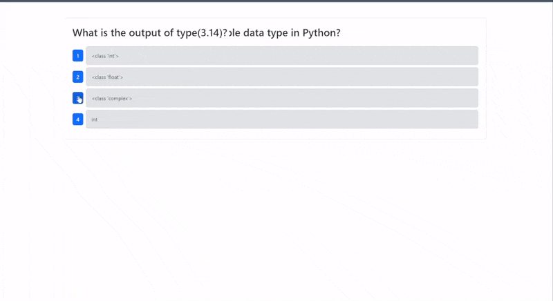
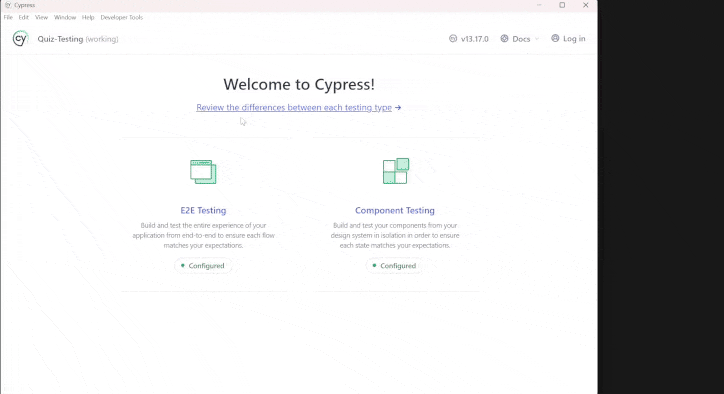
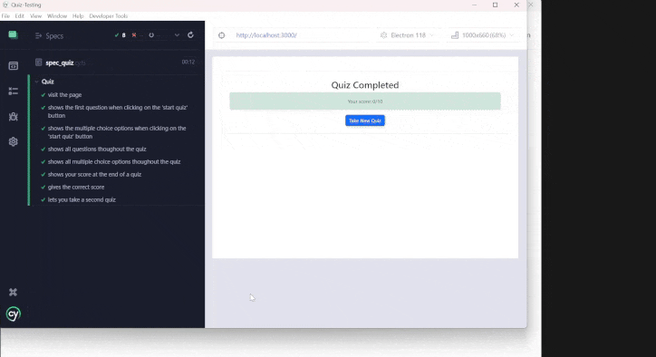

# Quiz-testing


## Description

Description

## 📁 Table of Contents

- [Installation](#installation)
- [Usage](#usage)
- [Tests](#tests)
- [Credits](#credits)
- [Contributing](#contributing)

## Installation

If you want to use the app, go to [this url](https://quiz-testing.onrender.com) and follow the instructions under the [Usage](#usage) tab. If you want to run this app on your local machine, follow these instructions:

Resources:

- [Node Installation](https://nodejs.org/en/download/package-manager)
- [MongoDB Installation](https://coding-boot-camp.github.io/full-stack/mongodb/how-to-install-mongodb)

```shell
# Step 1: clone this repository:
git clone https://github.com/Dan-Swarts/Quiz-Testing
cd Quiz-Testing

# Step 2: install dependencies:
npm ci

# Step 3: build the program:
npm run build

# Step 4: configure enviornment variables:

# remove '.EXAMPLE' from the '.env.EXAMPLE' file.
# fill in 'MONGODB_URI' with the connection to your monogDB
# server. If you follow the installation above, the default
# URI should work. Optionally, you can fill in the 'PORT'
# value.

# Step 5: seed the databse:
npm run seed

# Step 6: run the program:
npm run start
```

## Usage

- visit [this url](https://quiz-testing.onrender.com/), then take a quiz


<br>
<br>
<br>

- When you finish, you can take another quiz!



## Tests

- Use these commands to run the testing program:

```shell
# runs end-to-end-tests
npm run test

# runs component tests
npm run test:component
```

### [Watch this video to see how to run the tests from the command line.](https://drive.google.com/file/d/1SD0M9clICjoXa1Mrvmzr3BRsQH_NSCXT/view?usp=sharing)

IMPORTANT: ensure that your server is running with npm run start, and that the server is running on the same port found in cypress/e2e/spec_quiz.ts.

### Alternatively, you can run tests from the cypress GUI with this command:

```shell
node_modules/.bin/cypress run
```

Then follow these instructions:


<br>
<br>
<br>

- Run end-to-end tests:


<br>
<br>
<br>

- Run component tests:



## Credits

- [Northwestern Bootcamp Team](https://sps.northwestern.edu/professional-development/)
- [Daniel Swarts](https://github.com/Dan-Swarts)

## Contributing

> [!IMPORTANT]
> Whether you have feedback on features, have encountered any bugs, or have suggestions for enhancements, we're eager to hear from you. Your insights help us make the Quiz-testing library more robust and user-friendly.

Please feel free to contribute by [submitting an issue](https://github.com/Dan-Swarts/Quiz-Testing/issues) or [joining the discussions](https://github.com/Dan-Swarts/Quiz-Testing/discussions/new?category=announcements&welcome_text=true). Each contribution helps us grow and improve.

We appreciate your support and look forward to making our product even better with your help!

If you created an application or package and would like other developers to contribute it, you can include guidelines for how to do so. The [Contributor Covenant](https://www.contributor-covenant.org/) is an industry standard, but you can always write your own if you'd prefer.
